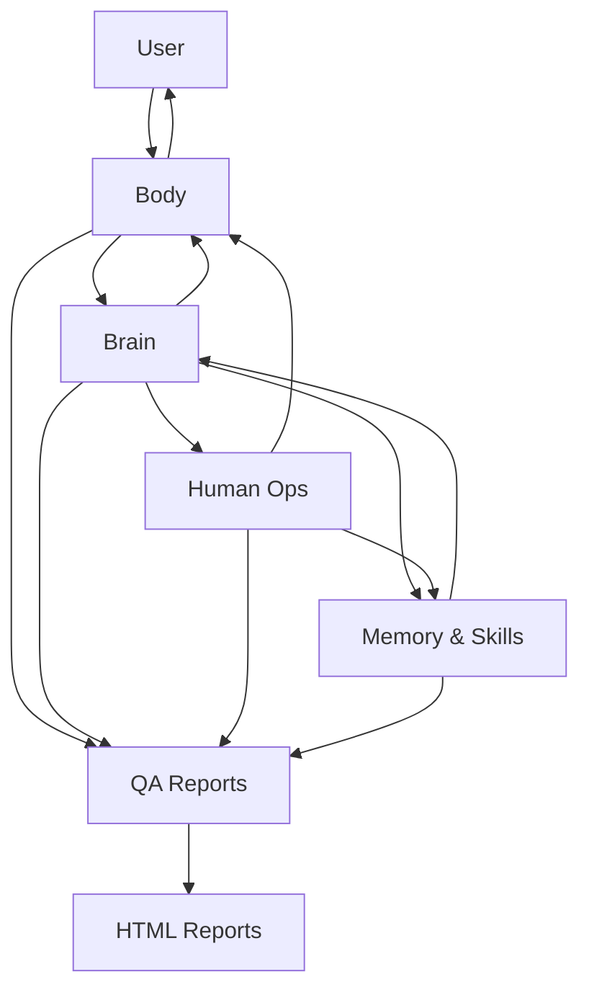

# Ipet Neo Aspect Architecture

## 1. Positioning

Ipet Neo Aspect is a local desktop pet product. The pet is not a thin skin over another application; it owns the user experience, local context, approval boundary, and durable product memory.

The current architecture is Body-first:

```text
Body senses and speaks.
Brain decides one next step.
Human Ops approves risky effects.
Memory & Skills remembers and teaches.
```

## 2. Module Map



## 3. Body

Body is the product surface and local machine boundary. It owns:

- desktop host lifecycle
- pet window behavior
- chat bubbles, expressions, motions, and TTS presentation
- ASR and voice input state
- local screen observation when enabled
- bounded local command execution after approval
- frontend event rendering

Body does not invent durable facts. It observes, renders, executes approved actions, and reports results back to Brain.

## 4. Brain

Brain owns the LLM decision for a single turn. Its input is a compact packet:

- current user request
- relevant recent conversation
- allowed memory snippets
- Body observation summary
- available skills
- current approval or execution status

Brain returns exactly one next step:

- `say`
- `act`
- `remember`
- `learn_skill`
- `stop`

Brain does not directly mutate files, settings, memory, UI, or processes. It asks other modules to do bounded work.

Brain calls a user-selected LLM provider through a narrow API boundary. The supported wire formats are OpenAI-compatible chat completions, Ollama chat, and Anthropic-compatible messages. Provider endpoint, model name, temperature, and optional API key are configured in the web settings page and saved only in local configuration.

## 5. Human Ops

Human Ops is the safety and approval layer. It owns:

- risk classification
- approval prompt copy
- reject and approve-with-constraints flow
- execution ledgers
- audit text for local actions
- user-visible explanation of side effects

Any action that touches files, processes, configuration, network access, external services, destructive operations, or durable user data must pass through Human Ops.

## 6. Memory & Skills

Memory & Skills owns the durable learning surface:

- conversation memory
- summaries
- user preferences
- skill manifests
- learned procedures
- retention and privacy rules

Memory entries should include source, reason, scope, and retention expectation. Learned skills should include trigger, procedure, approval needs, and verification method.

## 7. Data Flow

```text
User input
  -> Body observe/say
  -> Brain one-step decision
  -> Human Ops approval when needed
  -> Body execute or render
  -> Body observe result
  -> Memory & Skills write when allowed
  -> Brain terminal summary
  -> HTML report for file-changing task rounds
```

The design intentionally avoids hidden long autonomous chains. If the next step changes risk or scope, Brain must stop and ask for a new Human Ops decision.

## 8. Current Implementation Notes

The repository is mid-transition:

- `main.py` remains the desktop host entrypoint.
- `backend/` remains the active Python API surface.
- `index.html` remains the pet UI entry at the root.
- `settings.html`, `settings.css`, and `settings.js` remain the settings UI at the root.
- Target module directories are `body/`, `brain/`, `human_ops/`, `memory/`, `skills/`, `app/`, and `frontend/`.

New code should move toward the target module names when the implementation owner confirms the migration path. Documentation should describe the Neo module model even when code has not fully moved yet.

## 9. Development Rules

- Keep Body-first boundaries clear.
- Keep Brain decisions single-step and inspectable.
- Route risky effects through Human Ops.
- Treat Memory & Skills as durable product data.
- Preserve root UI files until loader paths move in the same task.
- Generate an HTML report after each file-changing task round.
- Do not revert coworker changes outside your assigned slice.

## 10. Summary

Ipet Neo Aspect is a local desktop pet whose Body interacts with the world, Brain chooses the next step, Human Ops protects the user, and Memory & Skills makes the pet better over time.
