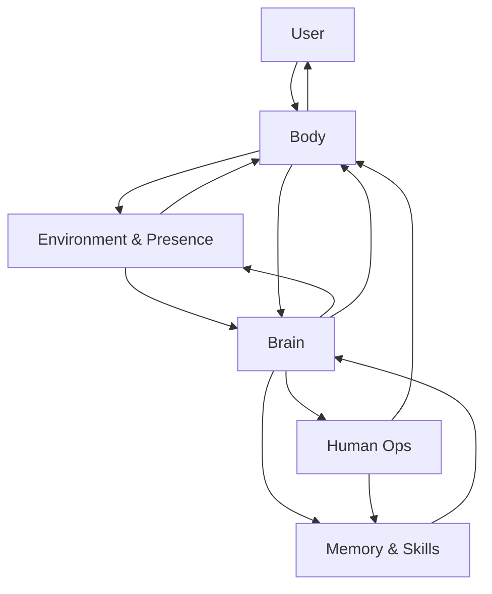

# Ipet Neo Aspect Architecture

## 1. Positioning

Ipet Neo Aspect is a local desktop pet product. The pet is not a thin skin over another application; it owns the user experience, local context, approval boundary, and durable product memory.

The current architecture is Body-first:

```text
Body senses and speaks.
Brain decides one next step.
Human Ops approves risky effects.
Memory & Skills remembers and teaches.
```

## 2. Module Map



## 3. Body

Body is the product surface and local machine boundary. It owns:

- desktop host lifecycle
- pet window behavior
- chat bubbles, expressions, motions, and TTS presentation
- ASR and voice input state
- local screen observation when enabled
- bounded local command execution after approval
- frontend event rendering

Body does not invent durable facts. It observes, renders, executes approved actions, and reports results back to Brain.

### Environment & Presence

Environment & Presence is a process-local Body/Backend subsystem. `body/environment_controller.py` produces a metadata-only presence sample; optional screen capture remains in `body/screen_vision_controller.py`. `backend/environment.py` owns privacy filtering, expiring state, opportunity policy, cooldowns, and audit metadata. `backend/environment_routes.py` owns local authenticated ingestion, safe status, proactive pulse/feedback, and the restored vision frame boundary. `frontend/proactive_presence.js` is the final busy-state gate and presentation adapter.

The subsystem deliberately separates perception from expression:

```text
Body metadata / optional frame
  -> privacy filter
  -> expiring semantic event
  -> shadow or active opportunity gate
  -> Brain say/stop wording
  -> frontend busy-state recheck
  -> visible message / optional TTS
  -> delivery feedback and one-turn reply context
```

Screenshots and raw screen text are never durable relationship memory. Persona may shape wording but cannot change observed facts, privacy policy, opportunity limits, or Human Ops authority. Environment settings are part of the Settings Console contract; `off` is the default, and screen semantics plus window titles require separate opt-ins.

## 4. Brain

Brain owns the LLM decision for a single turn. Its input is a compact packet:

- current user request
- relevant recent conversation
- allowed memory snippets
- Body observation summary
- available skills
- current approval or execution status

Brain's system prompt has two explicit layers. `prompts/Ipet.md` is the global contract and owns capability boundaries, evidence discipline, Human Ops safety, the one-step decision model, and the JSON output schema. A user-selected Markdown file from `prompts/` is rendered only into the bounded persona slot for identity, tone, speaking style, and role-play. The global contract is restated after dynamic persona, self-state, and summary data, so a persona cannot expand actions, bypass approval, weaken verification, or replace the output schema. The selected filename is stored as `brain.persona_prompt_file`; prompt content remains in its Markdown file and is read at turn time.

Brain returns exactly one structured next step:

- `say`
- `observe`
- `act`
- `remember`
- `learn_skill`
- `stop`

Brain does not directly mutate files, settings, memory, UI, or processes. It asks other modules to do bounded work.

LLM output is classified into `BrainDecision`. Providers are asked to return a compact JSON object such as `{"kind":"say","text":"..."}`. Plain text is accepted as `say` so chat remains usable. `say`, `think`, `observe`, `propose_act`, `propose_remember`, and `stop` have executable runtime paths; `propose_learn_skill` remains reserved until its own reviewed persistence loop is complete.

Brain calls a user-selected LLM provider through a narrow API boundary. The supported providers are OpenAI-compatible chat completions, Ollama chat, Anthropic-compatible messages, Google AI Studio Gemini `generateContent`, and the locally installed Codex CLI. Provider endpoint, model name, temperature, optional streaming, and optional API key are configured in the web settings page and saved only in local configuration. Google AI Studio uses the official Gemini API endpoint by default. The Codex option needs neither endpoint nor API key: it reuses the local Codex login and its account-side usage entitlement without copying credentials into Ipet.

The Brain provider boundary accepts text decisions plus an optional current screenshot. When the independent Human Ops observe model is disabled, Body captures the bounded screenshot and attaches it only to the immediately following Brain decision call. Before that boundary, an AX-insufficient application frame may be searched locally with macOS Vision OCR: the complete normalized text-box list remains process-local, while only query-matching labels enter compact `visual_search` context; a converted screen point is exposed only for one strong unique action match, which may avoid the model image call. The same selected Brain provider and model therefore perform any remaining visual interpretation and the next one-step decision; the original goal, previous decision, coordinate contract, and structured system evidence stay in the compact ReAct continuation prompt instead of crossing a separate VLM-to-text boundary. Body dynamically resolves regular running macOS GUI applications instead of restricting Accessibility to a fixed allowlist, then stores the latest complete exposed AX tree per external app under `data/ax_trees/` using atomically selected, chunked snapshots; every node retains its hierarchy path. The host PID is excluded at discovery, capture, action, and native AX-runtime boundaries. Frontmost identity prefers `NSWorkspace`, falls back to the native focused-application AX identity when PyObjC is unavailable, and never traverses the host tree. Brain explicitly supplies an application-agnostic `observe.ax_query` for the current `target_app`; search lazily reads that app's persisted tree and sends only a compact index plus top matching elements. Index status reads metadata without loading every stored tree. Full trees never cross the model boundary. Secure values are stripped during capture and again at the storage boundary, while other visible UI text remains local ignored state. Process changes and UI actions mark a snapshot stale, fail-safe-limited captures are labeled incomplete, live observation refreshes stale data, and action execution still re-resolves a unique current element rather than trusting the stored object path. OpenAI-compatible, Ollama, Anthropic-compatible, Google AI Studio, and Codex calls use their native image-input shapes. For direct-image clicks, Brain identifies the target in encoded screenshot pixels and labels the proposal `coordinate_space=image_pixels`; the backend validates and converts it to `macos_screen_points` before approval. The desktop Qt overlay is the sole native preview renderer, with the DOM marker retained only as a no-bridge fallback. An explicitly enabled Human Ops observe model remains the compatibility path for a separate or faster visual model.

Post-approval verification uses the cheapest reliable evidence first. Human Ops validates the action return and native foreground-focus state, then gives that structured result to Brain without capturing a frame. Visual observation is a fallback for missing structural evidence, an explicit Brain `observe` decision, or semantic outcomes that native event delivery cannot prove, such as whether an expected chat message appeared after Enter.

Browser-page operations use a bounded Playwright CLI capability inside Human Ops. Brain follows an explicit user choice of Playwright or human operation; without one it defaults to Playwright and does not ask which mode to use. The selected mode persists for the task and is revisited only when execution evidence proves it unavailable or the surface crosses a capability boundary. Every Playwright side effect is still a separate approval proposal. Human Ops allows only named navigation, snapshot, element-ref, text, key, and tab operations; it rejects arbitrary JavaScript and shell fragments. Successful CLI output is returned as structured evidence for the next Brain decision without forcing the desktop to change focus.

The settings page discovers Chrome personal profiles from `Local State` and stores the selected profile-directory name as `human_ops.playwright_profile`. A profile explicitly named in the current task overrides that saved default; Brain asks only when neither source provides a profile. Human Ops resolves exact display names or profile-directory names and never turns an arbitrary label into a blank browser profile. If the selected profile is the sole active profile and Chrome's remote-debugging endpoint is ready, `open` reuses that window and `attach --cdp=chrome` can connect to it explicitly. Otherwise `open` initializes a persistent Ipet-owned snapshot from the selected profile's cookies and web storage, then launches the snapshot visibly without writing the original Chrome directory. Unknown names, duplicate display names, multiple active profiles, and unavailable remote debugging fail explicitly rather than claiming the requested profile was selected.

Streaming and non-streaming Codex calls both prefer an ephemeral app-server thread whose base instructions replace the default Codex agent prompt. Shell, multi-agent, apps, plugins, browser, computer-use, image generation, goals, hooks, and workspace-dependency tools are disabled because Ipet owns those responsibilities; a screenshot is bounded request input, not a Codex tool. Codex built-in web search is the only optional tool: a Brain setting enables it, provider capability detection controls whether it is exposed, and supported read-only searches run directly without a user confirmation or Human Ops review. Unsupported providers fall back to a normal answer with an explicit no-search notice. Calls start outside the repository with read-only sandboxing and no approval escalation; `codex exec` remains only as a compatibility fallback when app-server fails before emitting visible output. Codex image input uses a temporary file outside the repository and deletes it after the call.

The settings page can pull a provider model list through `/api/brain/models` using the draft provider, endpoint, and optional key currently visible in the form. Codex discovery uses its short-lived app-server `model/list` protocol so the picker receives the account's concrete model IDs, input modalities, actual default model, and each model's supported reasoning efforts instead of a static list. Human Ops observe discovery filters Codex results to models advertising image input. Returned model IDs can be filled into the model field with one click, and secrets are not echoed. The same provider state is preserved by the desktop host when local config is saved, including the independent Human Ops observe model key.

The Brain page reads the available persona catalog through the read-only `/api/settings/persona-prompts` endpoint. The endpoint lists valid `.md` files directly inside `prompts/`, excludes the reserved `Ipet.md`, rejects path traversal and out-of-folder symlinks, and returns bounded UTF-8 content for the filename and preview controls. A missing selected file is shown explicitly in settings and fails the next Brain call instead of silently changing personality.

## 5. Human Ops

Human Ops is the safety and approval layer. It owns:

- risk classification
- approval prompt copy
- reject and approve-with-constraints flow
- execution ledgers
- audit text for local actions
- user-visible explanation of side effects

Any action that touches files, processes, configuration, network access, external services, destructive operations, or durable user data must pass through Human Ops.

## 6. Memory & Skills

Memory & Skills owns the durable learning surface:

- conversation memory
- summaries
- user preferences
- skill manifests
- learned procedures
- retention and privacy rules

Memory entries should include source, reason, scope, and retention expectation. Learned skills should include trigger, procedure, approval needs, and verification method.

Relationship memory remains file-backed under local ignored state. Brain can explicitly propose save, correction, forget, open-loop resolution, or snooze, but Human Ops owns the pending proposal and applies it only after approval. A deterministic post-turn extractor can create one implicit candidate without changing durable state. The settings Memory API exposes approved records and process-local candidates, while user edits and forgetting remain explicit console actions.

Before a persistent Brain turn, Memory selects at most five active, unexpired records under a 1,200-character budget. The resulting block is injected as non-command fact data. Temporary turns bypass this path entirely. Open loops add due-time, quiet-hour, cooldown, resolve, and snooze state without introducing a scheduler service; they become eligible when the user next talks to Ipet.

## 7. Data Flow

```text
User input
  -> Body observe/say
  -> Brain one-step decision
  -> Human Ops approval when needed
  -> Body execute or render
  -> Body observe result
  -> Memory & Skills write when allowed
  -> Brain terminal summary
```

Ambient flow is independent of the user-turn executor:

```text
Body presence sample -> privacy/event gate -> optional Brain say/stop -> Body presentation -> feedback
```

The design intentionally avoids hidden long autonomous chains. If the next step changes risk or scope, Brain must stop and ask for a new Human Ops decision.

## 8. Current Implementation Notes

Root paths remain stable for desktop compatibility, with explicit entrypoint boundaries:

- `main.py` composes the desktop host, Qt lifecycle, and compatibility wrappers; desktop feature behavior lives in `app/` and `body/`.
- `backend/app.py` configures FastAPI, middleware, state, dependencies, router registration, and compatibility exports; routes and domain behavior live in backend route/helper/adapter modules or their product module.
- `index.html` is the root pet UI document and script loader; `frontend/index.js` starts the controller graph, and UI behavior lives in focused `frontend/` modules.
- `settings.html`, `settings.css`, and `settings.js` remain the settings UI at the root.
- Product and implementation module directories include `body/`, `brain/`, `human_ops/`, `memory/`, `skills/`, `app/`, `backend/`, and `frontend/`.

New domain code must go to its owning module. Keep root entrypoints limited to composition, registration, loading, lifecycle, and compatibility delegates.

## 9. Implementation Constraints

- Keep Body-first boundaries clear.
- Keep Brain decisions single-step and inspectable.
- Route risky effects through Human Ops.
- Treat Memory & Skills as durable product data.
- Preserve stable root UI paths until loader paths move in the same task, and keep `index.html` free of new interactive behavior.

## 10. Summary

Ipet Neo Aspect is a local desktop pet whose Body interacts with the world, Brain chooses the next step, Human Ops protects the user, and Memory & Skills makes the pet better over time.
