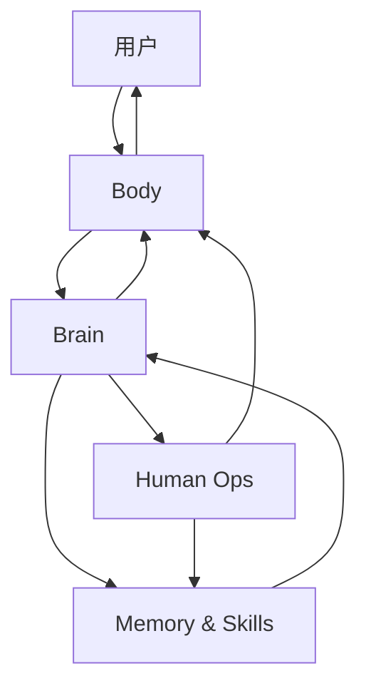

# Ipet Neo Aspect 架构说明

## 1. 项目定位

Ipet Neo Aspect 是一个本地桌宠产品。桌宠不是另一个应用的薄皮肤；它自己负责用户体验、本地上下文、审批边界和长期产品记忆。

当前架构采用 Body-first 设计：

```text
Body 负责感知和表达。
Brain 负责下一步决策。
Human Ops 负责危险影响审批。
Memory & Skills 负责记忆和学习。
```

## 2. 模块图



## 3. Body

Body 是产品表面，也是本地机器边界。它负责：

- 桌面宿主生命周期
- 宠物窗口行为
- 聊天气泡、表情、动作和 TTS 表现
- ASR 与语音输入状态
- 启用后的本地屏幕观察
- 审批后的受控本地动作执行
- 前端事件渲染

Body 不凭空生成长期事实。它观察、展示、执行已审批动作，并把结果交回 Brain。

## 4. Brain

Brain 负责单轮 LLM 决策。它接收紧凑的 turn packet：

- 当前用户请求
- 近期对话上下文
- 允许使用的记忆片段
- Body 观察摘要
- 可用技能
- 当前审批或执行状态

Brain 每次只返回一个结构化下一步：

- `say`
- `think`
- `observe`
- `propose_act`
- `propose_remember`
- `stop`

Brain 不直接改文件、改设置、写记忆、操作 UI 或管理进程。它只提出意图，由其他模块做边界清晰的执行。

LLM 输出会被归类成 `BrainDecision`。提示词要求 provider 返回类似 `{"kind":"say","text":"..."}` 的紧凑 JSON；普通文本仍按兼容 `say` 处理。Decision、Action、goal 状态和 profile 白名单只定义一次，提示词渲染与运行时校验读取同一份 schema。模型依据完整语义选择当前 profile 内的下一步；关键词只能辅助解析已选定观察里的标签，不能选择可执行路由、授权动作、覆盖终态或强制继续。需要坐标时由 `observe.require_coordinates=true` 明确声明；被动视觉 grounding 和帧注入也只认显式请求/配置状态，不扫描视觉词表。

系统提示词按场景拆为主动陪伴、纯聊天、通用 agent、桌面纠错和文件纠错。主动陪伴与纯聊天不会携带桌面和文件能力；运行时会同时拒绝 profile 未开放的 kind 和 action。正常跨域续步使用通用 agent，窄 profile 只用于定向纠错，不承担语义路由，也不重放人格与历史。普通 provider 调用前，人格、自我状态和系统摘要分别限制为 8000、2000 和 6000 字符。初始 Brain、纠错、观察和动作后续共用一个任务预算（默认 10、最高 20），审批不会重置。续步只发送状态增量和精确错误，不重放整条历史。

Brain 通过窄 API 边界调用用户选择的大模型服务。当前支持 OpenAI 兼容 chat completions、Ollama chat、Anthropic 兼容 messages、Google AI Studio 和本地 Codex。Provider 端点、模型名、温度和可选 API Key 都在 Web 设置页配置，并只保存在本地配置里。Codex 在同一任务内复用一个 app-server 进程，每次单步决策使用新的临时 thread；能力探测按任务缓存。app-server 在输出前失败时，该任务只切换一次 CLI 兼容路径，不会每一步重复双路探测。

设置页可以通过 `/api/brain/models` 使用表单里当前尚未保存的 provider、endpoint 和可选 key 拉取模型列表。返回的模型 ID 可以一键填入模型名称字段，密钥不会回显到浏览器。

浏览器任务优先遵循用户明确选择的 Playwright 或人类操作方式；未指定时默认 Playwright，不询问执行方式。设置页从 Chrome `Local State` 列出个人资料，并将选中的 Profile 目录名保存为 `human_ops.playwright_profile`。当前任务显式指定的资料优先于设置默认值；两者都缺少时 Brain 才询问。

模型内置的只读联网搜索在已启用且受支持时可直接执行，无需用户再次确认或 Human Ops 审批。该授权不包括 Playwright 网页操作、下载、登录、提交表单或其他外部状态变更。

## 5. Human Ops

Human Ops 是安全与审批层。它负责：

- 风险分级
- 审批提示文案
- 拒绝与带约束批准流程
- 执行记录
- 本地动作审计文本
- 对用户解释副作用

除上述已明确授权的只读内置联网搜索外，任何会触及文件、进程、配置、网络访问、外部服务、破坏性操作或长期用户数据的动作，都必须经过 Human Ops。

每个已执行动作都必须验证。先使用执行回执、应用状态、Accessibility/DOM 或 Playwright 结果，结构证据不足时才观察图像。审批后是否再次调用 Brain，只由提案的 `continue_after_approval` 或非终态 `goal.next` 决定，不能从用户原话猜测。

## 6. Memory & Skills

Memory & Skills 负责长期学习表面：

- 对话记忆
- 摘要
- 用户偏好
- 技能清单
- 学到的流程
- 保留周期和隐私规则

记忆条目应包含来源、原因、范围和保留预期。当前没有可执行的 Brain 学习技能决策；在建立显式审阅和持久化路径前，不得用预留 kind 假装已经学习。未来若启用，记录必须包含触发条件、步骤、审批要求和验证方法。

## 7. 数据流

```text
用户输入
  -> Body observe/say
  -> Brain 单步决策
  -> 需要时进入 Human Ops 审批
  -> Body 执行或展示
  -> Body 观察结果
  -> 允许时 Memory & Skills 写入
  -> Brain 给出终态总结
```

这个设计刻意避免隐藏式长链路自动执行。只要下一步改变风险或范围，Brain 就应停下，让 Human Ops 重新判断。

## 8. 当前实现备注

仓库正在迁移中：

- `main.py` 仍是桌面宿主入口。
- `backend/` 仍是当前 Python API 表面。
- `index.html` 仍是根目录桌宠 UI 入口。
- `settings.html`、`settings.css`、`settings.js` 仍是根目录设置页。
- 目标模块目录是 `body/`、`brain/`、`human_ops/`、`memory/`、`skills/`、`app/`、`frontend/`。

新代码应在实现 owner 确认迁移路径后向目标模块靠拢。文档应描述 Neo 模块模型，即使代码尚未全部搬完。

## 9. 实现约束

- 保持 Body-first 边界清楚。
- Brain 决策必须单步、可检查。
- 危险影响必须经过 Human Ops。
- Memory & Skills 是长期产品数据。
- 根目录 UI 文件在加载路径同步迁移前继续保留。

## 10. 一句话总结

Ipet Neo Aspect 是本地桌宠：Body 与世界交互，Brain 选择下一步，Human Ops 保护用户，Memory & Skills 让它逐渐变聪明。
